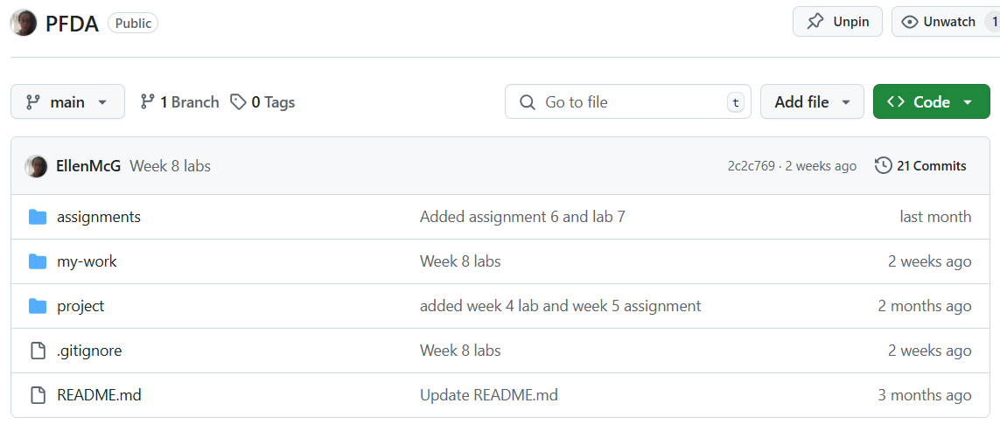

# **Assignments**

This Github repo contains the assignment completed as part of the Programming for Data Analytics module done as part of the Higher Diploma in Computing (Data Analysis) at ATU Galway

## **Assignments**
- **Assignment 1 - repo** - Create a repo (PFDA) for this module (Programming for Data Analytics) that contains three folders
   - `assignments` (for asignments created as part of this module)
   - `project` (for the project work created as part of this module)
   - `my-work` (for labs done as part of this module)

This sturcutre is shown below 

 

- **Assignment 2 - Plotting** - create a Jupyter Notebook called *assignment_2_weather.ipynb* that plots temperature (*dryBulbTemperature_Celsius*) using the *weatherreadings1.csv* file located on lecturers Github [page](https://github.com/andrewbeattycourseware/PFDA-courseware). 

- **Assignment 3 - Domains** - Create a notebook called *assignment_3_pie.ipynb*. The note book should have a nice pie chart of peoples email domains in the csv file at the [URL](https://drive.google.com/uc?id=1AWPf-pJodJKeHsARQK_RHiNsE8fjPCVK&export=download). 

- **Assignment 5 - Risk** - Write a program called *assignment_5_risk* (.py or .ipynb). The program should simulates 1000 individual battle rounds in Risk (3 attacker vs 2 defender) and plots the result. One battle round is one shake of the attacker and defender dice.

 - **Assignment 6 - Weather** - Write a program called *assignment_6_Weather* (.py or .ipynb) and plot weather data in Knock from this [data source](https://cli.fusio.net/cli/climate_data/webdata/hly4935.csv)

**Note:** There is no Assignment 04


## **Contents of repo**
- *assignment_2_weather.ipynb*
- *weatherreadings1.csv*
- *assignment_3_pie.ipynb*
- *assignment_5_risk.ipynb*
- *assignment_6_weather.ipynb*
- *README.md*
- *requirements.tt*

There is also an `img` directory. 

## **Running this repository**
This repo can be run in two ways;
- Running locally
- Github codespaces

### **Running this repository locally** 

To be run locally, the user must have [`Anaconda`](https://www.anaconda.com/) (or similar) and an IDE ([`Visual Studio Code`](https://code.visualstudio.com/) was used for this project). 

1. Clone the repository
```
$ git clone https://github.com/EllenMcG/PFDA.git
```

2. Change directory
```
$ cd assignments
```

2. Open and run any of the Jupyter Notebooks.

#### **Dependencies** 
Note: if user is not using an IDE but just using python then the dependencies need to be installed first listed in the `requirements.txt` file below.

``` 
$ pip install -r requirements.txt
```

An alternative way to install dependencies not using the `requirements.txt` file is shown below; 

```
$ pip install matplotlib.pyplot pandas random numpy seaborn
```

### **Running this repositry on Github Codespaces**

GitHub Codespaces is an online IDE that allows you to run your project in a cloud-based environment without needing to set up anything on your local machine. Here's how to get started:

1. Open the repository in GitHub Codespaces:
- Go to the repository's page on GitHub.
- Click the green Code button.
- Select Open with Codespaces.

2. Start the Jupyter Notebook in Codespaces:
Once your Codespace is ready:
- Open the integrated terminal in GitHub Codespaces.
- Make sure your virtual environment is activated (if you're using one). If not, you can skip this step.
- Open and run any of the Jupyter Notebooks.
