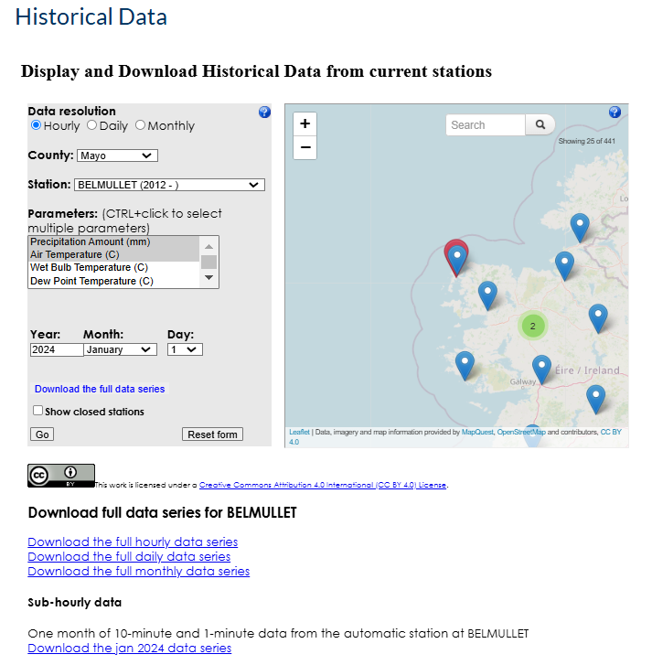

# Project

This Github repo contains the project work completed as part of the Programming for Data Analytics module done as part of the Higher Diploma in Computing (Data Analysis) at ATU Galway. 

## Project Goal 
This project will focus on pulling from [Met Éireann](https://www.met.ie/) for analysis. The main objectives of this project will be to 
- Calculate average monthly rain per decade 
- Estimate daily power output 

## The Dataset
Data was downloaded from the Historical web page for the weather station in Belmullet (shown below).


Belmullet weather station (9 masl, 54°13‘39” N, 10°00’25’’ W) opened in September 1956. It replaced the station at Blacksod Lighthouse, 10 miles to the SW, which was run by the Sweeney family. It was from Blacksod that the observation, which finally determined the date of the D-Day landings in June 1944, emanated. The station is regarded as being particularly important because of its location on the western fringe of Europe. In 2012, the manual station was replaced by an AWS situated on the same site. Information taken from [Met Éireann](https://www.met.ie/climate/weather-observing-stations). The dataset contains a mix of manual data (1956-2011) and automatic data (>2012).

Due to its location on the western fringe of Europe it was picked for this reason to investigate wind energy. 

The downloaded zipped dataset (`hly2375.zip`) was unzipped and downlaoded into the `data/` subdirectory. 

The columns of data are (retrieved from `data/KeyHourly.txt`);

| ID                      | ELEMENT          |   UNIT            
| :-------- | :-------: | -------: |
| rain  | Precipitation Amount    |       mm           |
|temp    |   	Air Temperature 	 |                           °C |
|wetb	|	Wet Bulb Air Temperature	|		            °C|
|dewpt	|	Dew Point Air Temperature	|		°C	|	                 
|vappr	|	Vapour Pressure				|			        hpa |
|rhum	|	Relative Humidity			|			        % |
|msl	|	    Mean Sea Level Pressure	|					    hPa |
|wdsp	|	Mean Hourly Wind Speed		|				    kt |
|wddir	|	Predominant Hourly wind Direction		|		deg |
|ww		  |  Synop Code Present Weather - decode below | decode below |
|w		 |   Synop Code Past Weather - decode below    | decode below |
|sun	|	    Sunshine duration						|        hours |
|vis	|	    Visibility							     |       m |
|clht	|	Cloud Ceiling Height - if none value is 999	|	100s feet |
|clamt	|	Cloud Amount							     |   okta |


**Note:** While selected parameters could have being downloaded for a specific time period, the full hourly histroical dataset (to start of December 2024) was downloaded as below from the historical data web page from [Met Éireann](https://www.met.ie/climate/available-data/historical-data). Alternatively, daily or monthly could have being downloaded. 




Some papers were read in prepreparation for this project in terms of data analytics, such as these papers; [Murphy et al., 2023](https://www.sciencedirect.com/science/article/pii/S2212094723000610), [Kang and Reiner, 2022](https://www.sciencedirect.com/science/article/pii/S014098832200189X), and [Mateus et al., 2020](https://rmets.onlinelibrary.wiley.com/doi/10.1002/gdj3.92).

## **Development and Environment**
Both the tasks and projected were completed in [`Visual Studio Code`](https://code.visualstudio.com/) using python (V3.11) though [`Anaconda`](https://www.anaconda.com/). [ChatGPT](https://chatgpt.com/) was used to assist with writing the workflow file for the project. No additional python modules needed as this was done using modules available within Anaconda, however the `requirements.txt` file shows the python modules used as part of this assessment.

### Python Code 
To make the python code more efficient, some functions were transferred to a specific python class within the  `data_processing.py` script. On the other hand more generic ones were left within `project_functions.py`. 

## **Repository structure** 
This repository has the below structure. `project` is a subdirectory of `PFDA`. 

```
/project
├── /data/           
│   ├── /workflows/             # contains extracted data files 
├── /img/                       # data files generated in weather.ipynb
│   ├── /XX/                    # plots generated in project.ipynb
│   └── /XX/                    # weather files generated in project.ipynb
├── /python_scripts/            # directory of python scripts
│   ├── project_functions.py    # Main python file for functions used     
│   ├── data_processing.py      # python script with data processing classes 
│   ├── log_reg_test.py         # python script to test BinaryLogisticRegression class object            
│   └── requirements.py         # python script to print module name and version to requirements.txt
├── .gitignore                  # .gitignore file
├── README.md                   # README.md file 
├── requirements.txt            # python dependencies
└── project.ipynb               # main Jupyter Notebook of this project
```


## **Running this repository**
This repo can be run in two ways;
- Running locally
- Github codespaces

### **Running this repository locally** 

To be run locally, the user must have [`Anaconda`](https://www.anaconda.com/) (or similar) and an IDE ([`Visual Studio Code`](https://code.visualstudio.com/) was used for this project). 

1. Clone the repository
```
$ git clone https://github.com/EllenMcG/computer_infrastructure_assessment.git
```

2. Change to `project` subdirectory from repositroy root (`PFDA`)

```
cd .\project\
```

3. Open `project.ipynb` in `Visual Studio Code` and run


#### **Dependencies** 
Note: if user is not using an IDE but just using python then the dependencies need to be installed first listed in the `requirements.txt` file below. The dependencies were generated using `requirments.py` located within the `python_scripts` subdirectory. 

```
cd .\project\python_scripts\
```

To install dependencies 

``` 
$ pip install -r requirements.txt
```


### **Running this repositry on Github Codespaces**

GitHub Codespaces is an online IDE that allows you to run your project in a cloud-based environment without needing to set up anything on your local machine. Here's how to get started:

1. Open the repository in GitHub Codespaces:
- Go to the repository's page on GitHub.
- Click the green Code button.
- Select Open with Codespaces.

2. Start the Jupyter Notebook in Codespaces:
Once your Codespace is ready:
- Open the integrated terminal in GitHub Codespaces.
- Make sure your virtual environment is activated (if you're using one). If not, you can skip this step.
- Open `project.ipynb` in `Visual Studio Code` and run 

### **References**
[Murphy et al., 2023](https://www.sciencedirect.com/science/article/pii/S2212094723000610)

[Kang and Reiner, 2022](https://www.sciencedirect.com/science/article/pii/S014098832200189X)

[Mateus et al., 2020](https://rmets.onlinelibrary.wiley.com/doi/10.1002/gdj3.92)

